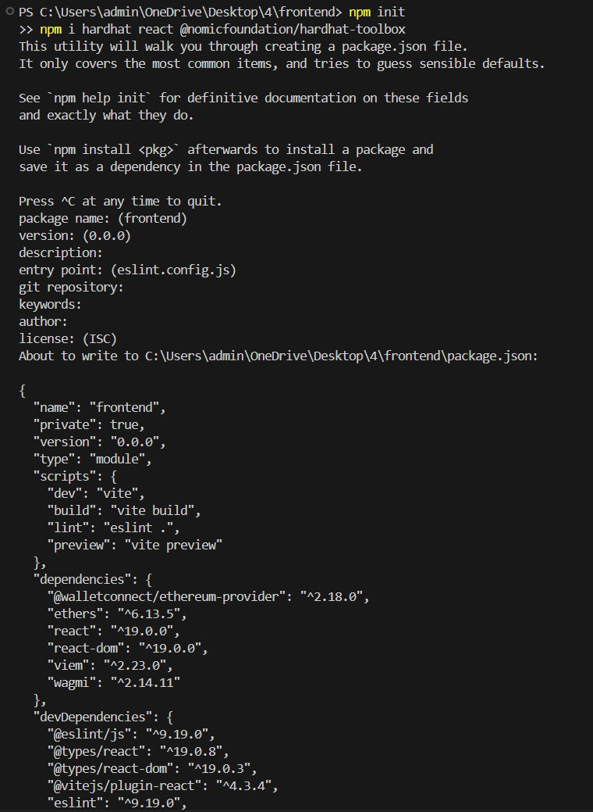
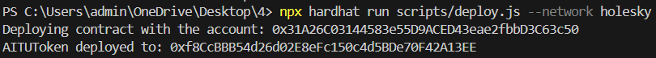
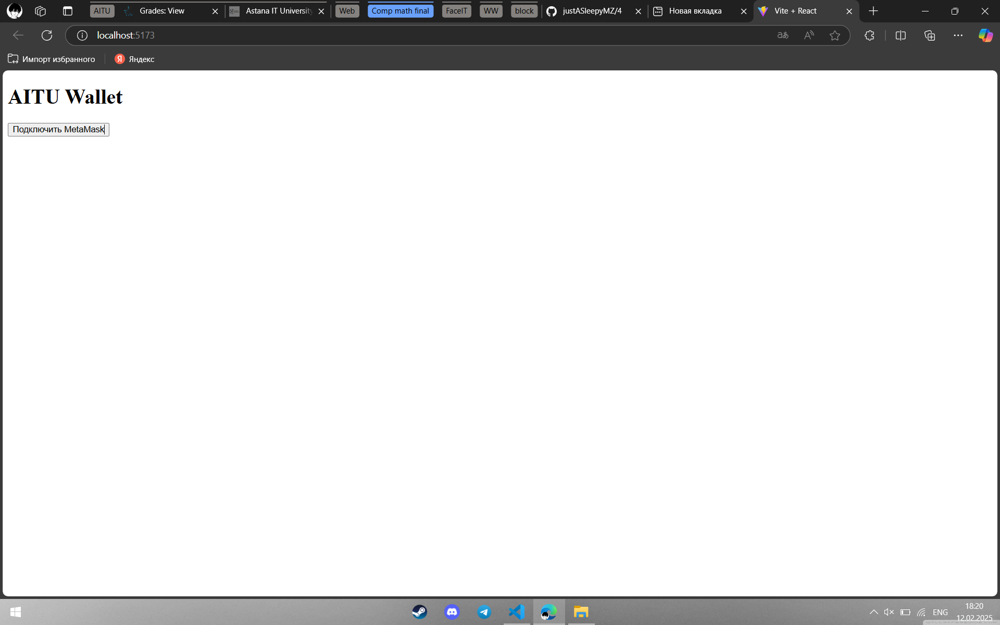
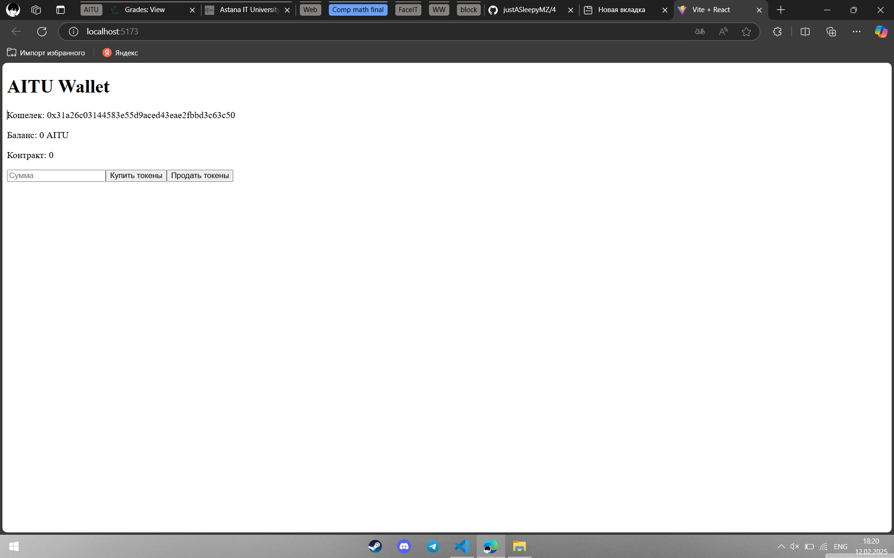

# BlockchainTechnologies

## Setup the enviroment

Make sure you have latest version on Node.js

```bash
`npm init
npm i hardhat react @nomicfoundation/hardhat-toolbox`
```


## Getting Started

To get started, first deploy the smart contract on some TestNet.

```bash
npx hardhat run scripts/deploy.js --network [your configuration]
```


Then paste your deployed contract address (`0x123...`) into `constants.js`. 

After all start the frontend server:

```bash
npm i
npm run dev
```


Then, open [http://localhost:5173](http://localhost:5173) in your browser to view the result.





## Tech Stack

- Solidity
- Hardhat
- React
- NodeJS


